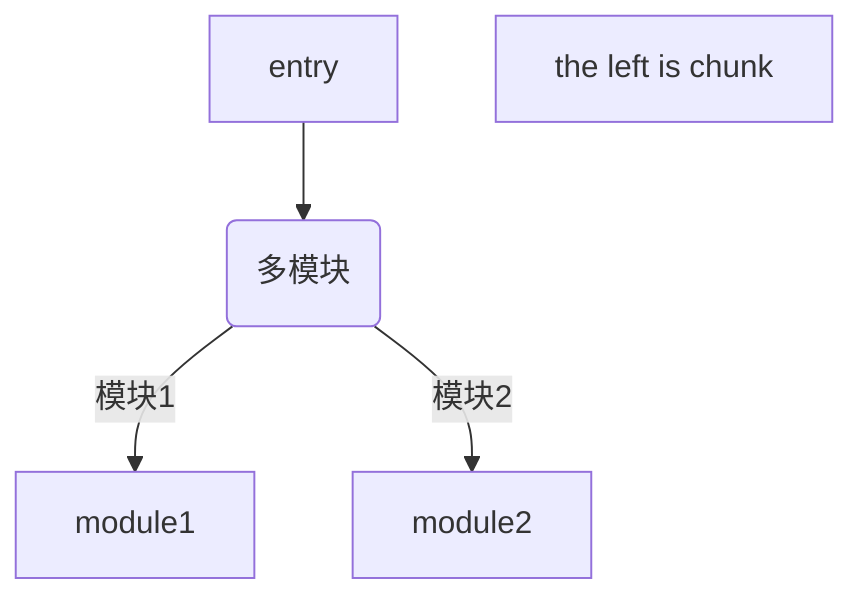
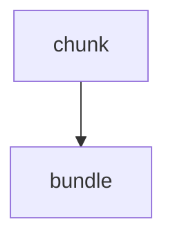
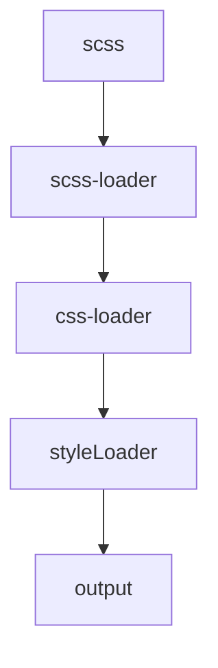

## 

## 1⃣️. 基础: 模块

### 一. 主要内容

1⃣️ 主流模块标准的特性和它们之间的不同

2⃣️ 模块语法

3⃣️ 模块打包📦原理


### 二. 主流模块

* commonjs
* es6


#### 1. commonjs

**起源**: node应用由模块组成（BrowserIfy打包工具），采用的commonjs模块规范。每一个文件就是一个模块，拥有自己独立的作用域，变量，以及方法等，**对其他的模块都不可见**

独立作用域的理解👇

```js
var name = 'zyk'  //zyk.js

var name = 'mxw'
require('./zyk.js')
console.log(name)	//'mxw'
```


**导出和导入**

**导出**有两种方法: `exports`, `module.exports`

```js
module.exports = {
  name: 'zyk',
  age: 20
}

//或者
exports.name = 'zyk'
```

**注意** exports其实是module.exports的一个复制引用，即每个commonjs模块都会在开头隐形地加一句：

```js
exports = module.exports
```

所以exports注意不能指向另一个引用，**因为导出的值其实看的是module.exports导出的值**

```js
module.exports = {
  name: 'zyk',
  age: 20
}

exports = {
  get: function() {}
}	//这句话无效，导出的还是{name: 'zyk',age:20}

// 分割线

exports.name = 'zyk'
module.exports = {
  name: 'mxw',
  age: 20
}

// 导出{name: 'mxw',age: 20} ，第一句被后面的覆盖了
```


**导入**，只需要注意两点

* 模块可以多次加载，但是只会在第一次加载时运行一次，然后运行结果就被缓存了，以后再加载，就直接读取缓存结果
* 支持条件语句下导入，或者在一个函数下面导入（灵活）

**关于第一点的具体说明**: 模块有一个值loader来记录当前模块是否被加载过，如果加载过的话loaded为true，下次调用该模块时如果loaded为true，则不会执行该模块代码


#### 2. ES6

它也有独立作用域，和coomonjs类似

导出更加灵活点....（没有exports和module.exports搞混


**导出**：

```js
export default {}	//一个文件只能有一句这个
export const name = 'zyk' 	//等价于 const name = 'zyk'; export { name }
```

**导入**: 

```js
import xxx from './'	//对应export default
import { xxx,yyy } from './'  //对应export
import React, { Component } from 'react'  //混合类型
```


### 三. 两个主流模块之间的区别

#### 1.加载过程的不同

1.commonjs模块建立依赖关系是在运行时决定的，而ES6是在编译的时候决定的
2.commonjs允许动态载入，ES6不允许（只能位于模块的顶层作用域）


对于1⃣️点的补充：

> commonjs模块在调用时才能确定依赖，这会导致不管你导入的变量有没有使用到，你总是会去跑一遍你导入的模块中的代码，而ES6在编译阶段就确定了依赖，有些导入变量如果没有用到，那么对应的模块代码永远不会被执行（性能更好）


对于2⃣️点的补充：

```js
import xxx from './'	//ES6

if(...) {const xxx = require('')}
else {
  const yyy = require('')
}  //commonjs
```


#### 2.导出值的不同

**一句话: commonjs导出的是值的拷贝，而es6导出的是值的映射**，且是read-only性质

举个例子🌰

```js
//  commonjs

//  demo.js
var count = 1;
module.exports = {
	count: count,
  add() {
    count += 1
  }
}

// index.js
const count = require('./demo.js').count
const add = require('./demo.js').add
add()
console.log(count)	//还是1，不会改变，因为当前是demo.js中值的一个拷贝，demo.js中的count改变不会影响当前的值
```


```js
//  ES6

//  demo.js
let count = 1;
let add = () => {
  count += 1
}
export { count, add }

//  index.js
import { count, add } from './demo'
console.log(count)  //1
add()
console.log(count)	//2（映射到demo中的count，所以会跟着改变
count = 3	 //不允许❌，read-only
```


**对于ES6的read-only有一点补充说明:**

```js
// 如果demo是默认导出：
let count = 1;
export default {
  count,
  add() {
		this.count += 1
  }
}

// 那么在index.js中可以修改count
// 因为此时导出的是一个对象，修改对象里面的key是允许的，但是不能把对象的引用指向另外一个值（违反read-only）
import Demo from './demo'
Demo.count = 2	//允许✅
Demo = {
	count: 2
}		//不允许❌
```


### 四. 打包📦原理

原本工程上各个模块之间的依赖关系是不能在浏览器环境上体现的（**浏览器不支持import，export语法**），webpack做的工作就是把模块打包成浏览器支持的语法

> **webpack就是识别你的 入口文件。识别你的模块依赖，来打包你的代码**。至于你的代码使用的是commonjs还是amd或者es6的import。webpack都会对其进行分析。来获取代码的依赖。webpack做的就是分析代码。转换代码，编译代码，输出代码，webpack本身是一个node的模块，所以webpack.config.js是以commonjs形式书写的(node中的模块化是commonjs规范的)
>
> 
>
> 作者：209bd3bc6844
> 链接：https://www.jianshu.com/p/e24ed38d89fd
> 来源：简书
> 著作权归作者所有。商业转载请联系作者获得授权，非商业转载请注明出处。


**大致过程就是:** 

* 初始化一个IIFE（在浏览器定义一些对象，函数）
* 加载入口模块
* 执行模块代码，如果遇到__webpack_require__，则准备把代码的执行权扔到required的模块中
* 判断required的模块有无执行过，执行过直接在缓存拿，没有执行过则执行required模块代码
* **重复3，4**步骤，直到入口模块代码结束


对于第一点的解释：

```js
(function (modules){
  //配置环境，建立缓存
})(modules)	//modules是要执行的模块，以数组形式存在

```

**下面对整个流程的详细解释**

```js
// bundle.js
/******/ (function(modules) {
/******/    //. 模块缓存，运行过的模块放在这里
/******/    var installedModules = {};

/******/    // The require function
/******/    function __webpack_require__(moduleId) {

/******/        //. 查看当前模块有无在缓存，有的话直接取值
/******/        if(installedModules[moduleId])
/******/            return installedModules[moduleId].exports;

/******/        //. 创建新模块
/******/        var module = installedModules[moduleId] = {
/******/            exports: {},
/******/            id: moduleId,
/******/            loaded: false		//根据这个看当前模块有没有加载过
/******/        };

/******/        // 执行模块代码 ⚠️⚠️，数组里面的模块就在这里执行
/******/        modules[moduleId].call(module.exports, module, module.exports, __webpack_require__);

/******/        // 标记模块加载过
/******/        module.loaded = true;

/******/        // Return the exports of the module
/******/        return module.exports;
/******/    }


/******/    // expose the modules object (__webpack_modules__)
/******/    __webpack_require__.m = modules;

/******/    // expose the module cache
/******/    __webpack_require__.c = installedModules;

/******/    // __webpack_public_path__
/******/    __webpack_require__.p = "";

/******/    // Load entry module and return exports
/******/    return __webpack_require__(0);
/******/ })
/**************************👇下面是模块，以数组形式存储**********************************************/
/******/ ([
/* 0 */
/***/ function(module, exports, __webpack_require__) {

    var b = __webpack_require__(1);  //. 导入id为1的模块

    console.log('a');

    b.b1();


/***/ },
/* id为1的模块 */
/***/ function(module, exports) {

    exports.b1 = function () {
      console.log('b1')
    };

    exports.b2 = function () {
      console.log('b2')
    };

/***/ }
/******/ ]);
```


## 2⃣️. 输入，输出

### 一. 什么是chunk

可以这么理解，chunk就是一个**装着模块**的容器，每个chunk都有一个唯一的入口，每个chunk打包生成对应的bundle


***



### 二. 配置入口文件

webpack通过 entry 和 context 两个属性来决定入口文件的路径，配置入口文件是为了: 

* 确定入口模块的位置，告诉webpack从哪里开始打包
* 定义chunk name


#### 1.context

类似于 entry 的 base地址，目的是为了配置多入口时编写代码更加简洁

```js
// 最常用
context: path.join(__dirname, './src')
```


#### 2.entry

**entry的配置很多元，字符串，数组，对象形式都可以**

```js
// 字符串
module.exports = {
  context: path.join(__dirname, './src'),
  entry: './index.js'
}

// 数组，作用是多个资源预先合并，打包时入口看的是数组最后一项
module.exports = {
  context: 同上,
  entry: ['react','./index.js']
}

// 对象（配置多入口）,下面的例子就是配置了index和lib两个chunk
module.exports = {
	context: 同上,
  entry: {
    index: './index.js',
    lib: './lib.js',
  }
}
```


#### 3.提取vendor

配置多入口还可以做到提取第三方库来达到避免打包只产生一个js文件，从而导致只要服务器上的js文件出现一点变化就会导致浏览器缓存失效的情况

```js
module.exports = {
  entry: {
    app: './src/index.js',
    vendor: ['react','react-dom']
  }
}
```

通过上面的配置（配合splitChunks）可以达到提取第三方库的作用


### 三. 配置出口文件

#### 1. filename

名字，而且支持动态命名（和chunk name 一一对应）:

```js
output: {
  filename: [name].js
}
```

**除了[name]，还有：**

| 功能                                | name        |
| ----------------------------------- | :---------- |
| 当前chunk对应的hash                 | [chunkhash] |
| webpack打包的所有模块内容对应的hash | [hash]      |
| 当前chunk对应的id                   | [id]        |

> Tips: 通过chunkhash可以控制客户端缓存


#### 2.path

**打包后资源存放的地方，必须为绝对路径**


#### 3.publicPath（这里指的是打包后的生产模式）

**一句话，指定publicPath后，对于资源的网络请求会以当前html所在路径上加上publicPath的相对路径，构成实际的请求url**

以我现在自己配置的react脚手架为例:

> 打个广告: 青鸢fe脚手架，集成react全家桶 + ts，开箱即用，无需配置ts环境: https://github.com/ZYK1236/react-ts-cli


```js
module.exports = {
  mode: 'production',
  entry: {
    app: path.join(__dirname, './../', 'src/index.tsx')
  },
  output: {
    path: path.join(__dirname, './../', 'dist'),
    publicPath: './',
    filename: '[name].js',
  },
  // ...省略一系列配置
}
```

此时output的publicPath是 `'./'`，**则各个资源的请求都是以html所在路径为baseUrl**；

如果还要细说就是👇

```js
//  这是项目打包后生成的目录dist
---
css📁
   |vendors.css
app.js
index.html
---
```

把打包后的dist文件夹扔到服务器上面，那么html所在的路径为`http:localhost:8080/dist/#index.html`

**（这里我们假设服务器为本地服务器**

此时html需要的css和js的请求的基本路径就是`http:localhost:8080/dist/`

> 如果publicPath为`'./js'`，css和js等资源的请求基本路径就是`http:localhost:8080/dist/js`
>
> 如果publicPath为`'/'`，css和js等资源的请求基本路径就是`http:localhost:8080/`


## 3⃣️. 处理器loader

### 一. 为什么需要loader

> webpack 只能理解 JavaScript 和 JSON 文件，这是 webpack 开箱可用的自带能力。**loader** 让 webpack 能够去处理其他类型的文件，并将它们转换为有效 [模块](https://webpack.docschina.org/concepts/modules)，以供应用程序使用

有了loader，webpack中的“一切皆模块”的理念就彻底贯彻了，非js类文件（css，jpg等）都可以被视为模块，也可以像js那样支持导入


### 二. loader是什么

**每个loader本质是一个函数**: `output = loader(input)`，用图表示则为:



### 三. loader的配置

最常见配置👇

```js
module.exports = {
	// ...
  module: {
    rules: [{
      test: /\.css$/,
      use: ['css-loader']
    }]
  }
}
```

**与loader相关的配置都在module对象中**，一般来说用的最多的是test和use两个字段

* test可接受正则字符串来过滤你想要使用loader的文件类型
* use表示你要用哪种loader

一般来说处理css文件只用css-loader是不够的，因为css-loader的作用是处理css相关语法，想让样式插入页面还要用style-loader，这也是下面要说的链式调用

对了，官网有个警示⚠️

> *请记住，使用正则表达式匹配文件时，你不要为它添加引号。也就是说，*`/\.txt$/` *与* `'/\.txt$/'` *或* `"/\.txt$/"` *不一样。前者指示 webpack 匹配任何以 .txt 结尾的文件，后者指示 webpack 匹配具有绝对路径 '.txt' 的单个文件; 这可能不符合你的意图。*


#### 1.支持链式调用

一般项目中我们会使用scss，less，stylues等css预处理器来写样式，这个时候就需要使用多个loader，以scss为例

```js
module.exports = {
  module: {
		rules: [{
      test: /\.scss$/,
      use: ['style-loader','css-loader','scss-loader']
    }] 
  }
}
```


#### 2.更多配置

* exclude: 匹配到的模块是排除在外不使用loader的
* include: 只在匹配到的模块中使用loader（exclude优先级更高


### 四. 常用loader

#### 1.babel-loader

将工程中的代码编译为ES5来达到兼容的效果

官网推荐安装方式:

```bash
npm install babel-loader@8.0.0-beta.0 @babel/core @babel/preset-env webpack
```

* babel-loader: **babel和webpack协同的模块**

* @babel/core: **babel编译器的核心模块**
* @babel/preset-env: **预置器（预先置备ES6，ES2016，ES2017语法）**


>官网: babel-loader 很慢！确保转译尽可能少的文件。你可能使用 `/\.js$/` 来匹配，这样也许会去转译 `node_modules` 目录或者其他不需要的源代码。
>
>要排除 `node_modules`，参考文档中的 `loaders` 配置的 `exclude` 选项。
>
>你也可以通过使用 `cacheDirectory` 选项，将 babel-loader 提速至少两倍。 这会将转译的结果缓存到文件系统中。


#### 2.ts-loader,file-loader,url-loader自己了解吧


### 五. 自定义loader

**下面的自定义loader的功能是在每个js文件的最上方加上'use strict'这句话**

配置文件目录如下，npm init后使用webpack-cli生成


***
> dist是打包📦后的生成文件的目标目录
>
> loaderDemo是自定义loader，下面有一个入口文件index.js


webpack.config.js配置如下:

```js
const path = require("path");

module.exports = {
  context: path.join(__dirname),
  entry: "./index.js",
  output: {
    filename: "bundle.js",
    path: path.join(__dirname, "./dist"),
  },
  
  module: {
    rules: [{
      test: /\.js$/,
      use: {
        loader: "./loaderDemo",	//loader指向自定义loader的文件夹
        // 定义配置，这个下面会细说
        options: {
          sourceMap: true
        }
      }
    }]
  }
};
```


#### 自定义loader文件的编写

```js
var loaderUtils = require("loader-utils");	//loader的帮助函数，安装方法自行google

module.exports = function (content) {
  // webpack启用缓存
  if (this.cacheable) {
    this.cacheable();
  }
  // 拿到webpack.config.js中loader的options具体配置项
  var options = loaderUtils.getOptions(this) || {};
  
  // 输出 optipns { sourceMap: true }
     -=-=-=-=-=-=-=-=--
  console.log("optipns", options);
  console.log("-=-=-=-=-=-=-=-=--");
  
  // loader的功能
  var useStrictPrefix = "'use strict';\n\n";
  return useStrictPrefix + content;
};

```


## 4⃣️. 样式处理

> 前言: 在一定规模的工程项目中，维护css是一个重要的工作，其中最常遇到的问题就是怎么处理样式命名冲突，虽然现在有styled-components这种css in js的解决方案，但是webpack中css module处理方式也不失为一种优雅的方法


### 一. 打包分离样式文件

一般来说，我们希望打包后的文件css和js分别拥有各自的维护文件，即打包后生成：

```js
 ---
   |📁js
   |📁css
```

可以使用webpack中的两个plugin（extract-text-webpack-plugin和mini-css-extract-plugin）

> plugin你可以理解为丰富webpack功能的插件

**后者是webpack4后推荐的，可以理解为extract-text的加强版**，现在基本都是使用后者，所以下文只会涉及到后者的配置


#### 1.mini-css-extract-plugin的使用

先上一个完整的webpack.config.js配置👇，具体使用方法看下面代码和注释

```js
const path = require("path");
// 导入
const MiniCssExtractPlugin = require("mini-css-extract-plugin");

module.exports = {
  context: path.join(__dirname),
  entry: "./index.js",
  output: {
    filename: "bundle.js",
    path: path.join(__dirname, "./dist"),
  },
  module: {
    rules: [
      {
        test: /\.css$/,
        use: [
          {
            // 将style-loader更改为MiniCssExtractPlugin的loader
            loader: MiniCssExtractPlugin.loader,
            options: {
              //你可以在这里指定特定的 publicPath，默认情况下使用 webpackOptions.output中的
              publicPath: "./",	
            },
          },
          "css-loader",
        ],
      }
    ],
  },
  plugins: [
    new MiniCssExtractPlugin({
      filename: "[name].css",
      // chunkFilename: '[id].css',	生成id命名的异步加载css文件
    }),
  ],
};

```

mini-css-extract的好处: 

- 异步加载（chunkfilename），避免首页全部加载资源，造成首页渲染时间过长
- 不重复编译（更好的性能）


### 二. css module

**css模块化有三个好处:** 

* **样式有单独的作用域，不会导致命名冲突**
* 可以像js一样引入css文件
* 轻松复用


#### 1.配置

不需要安装其他模块，只需要开启css-loader中的modules配置项即可

```js
module.exports = {
  // ..省略
	module: {
    rules: [
      // 对于第三方库不采用css module
      {
        test: /\.css$/,
        use: ['style-loader', 'css-loader'],
        include: /node_modules/
      },
      {
        test: /\.less$/,
        use: ['style-loader', 'css-loader','less-loader'],
        include: /node_modules/
      },
      // 对于src开发目录下的css文件采用css module
      {
        test: /\.css$/,
        use: [
          'style-loader',
          {
            loader: 'css-loader',
            options: {
              modules: {
                // name是模块名，local是选择器/标识符，hash是根据前面两者进行hash的
                localIdentName: '[name]_[local]_[hash:base64:5]'
              }
            }
          }
        ],
        exclude: /node_modules/
      },
      // less -> css module
      {
        test: /\.less$/,
        use: [
          'style-loader',
          {
            loader: 'css-loader',
            options: {
              modules: {
                localIdentName: '[name]_[local]_[hash:base64:5]'
              }
            }
          },
          {
            loader: 'less-loader'
          }
        ],
        exclude: /node_modules/
      }
    ]
  },
  // 省略...
}
```


#### 2.使用

index.less 👇

```css
.main {
  color: red
}
```

例如，在 index.tsx 中

```tsx
import styles from './index.less'

export default () => {
  console.log(styles)  // {main: "index_main_a2jb1" }
  
  return (
  	<div className={styles.main}>hello module</div>
  )
}
```

**样式文件中不管是id选择器和class选择器都会被转为一个对象中，但是标签选择器不会**


> ⚠️：ts项目下如果只有以上配置会报错，要在global.d.ts中声明一下css/less模块，不然ts识别不出来样式文件模块:
>
> ```ts
> declare module '*.png'
> declare module '*.gif'
> declare module '*.jpg'
> declare module '*.jpeg'
> declare module '*.svg'
> declare module '*.css'
> declare module '*.less'
> declare module '*.scss'
> declare module '*.sass'
> declare module '*.styl'
> ```


## 5⃣️. chunk split

> 首页白屏时间过长一直是做项目的忌讳，实现高性能应用的重要一点就是让每个页面只加载必要的资源，优先将必要资源加载后再延迟加载其他不那么重要的资源，而实现这个目的可以用分片技术来实现

简单来说，就是有一些第三方库代码是稳定的，不需要经常更改的（例如react，react-dom等），**一般这些文件我们可以单独打包出来**并配合缓存策略来使得用户不需要每次上网页就下载这些资源，避免不必要的资源下载时间浪费

**webpack4官网是推荐使用`splitChunks`来实现 chunk split 的**


### 一. 配置

splitChunks在webpack有一个默认配置，这也符合webpack4的开箱即用的特性，它的默认配置如下：

```js
module.exports = {
  //...
  optimization: {
    splitChunks: {
      chunks: 'async',
      minSize: 30000,
      minChunks: 1,
      maxAsyncRequests: 5,
      maxInitialRequests: 3,
      automaticNameDelimiter: '~',
      name: true,	// 缓存组里面的filename生效，覆盖默认命名
      cacheGroups: {
        vendors: {
          test: /[\\/]node_modules[\\/]/,
          priority: -10
        },
        default: {
          minChunks: 2,
          priority: -20,
          reuseExistingChunk: true
        }
      }
    }
  }
};
```

针对上面有两个重要的属性会在下面拎出来说一说

* chunks
* cacheGroups


#### 1. chunks属性

**chunks的含义是拆分模块的范围，它有三个值async、initial和all**

- async表示只从异步加载得模块（动态加载import）里面进行拆分
- initial表示只从入口模块进行拆分
- all表示以上两者都包括


#### 2. cacheGroups属性

直接看代码:

```js
cacheGroups: {
  // 将所有加载模块放在缓存里面一起分割打包（vendors和default）
  
  // vendors组
  vendors: {
    test: /[\\/]node_modules[\\/]/,	// 只筛选从node_modules文件夹下引入的模块
      
    priority: -10,	// 权重（优先级），先打包到哪个组里面
      
    filename: 'vendors.js'	//前提是上一层的name属性为true
  },
    
  // webpack默认的一个组
  default: {
    minChunks: 2,  // 模块至少使用次数
    priority: -20,
    reuseExistingChunk: true,
    filename: 'default.js'
  }
}
```


### 二. 异步加载资源

> 了解即可，官网地址： https://webpack.docschina.org/api/module-methods/#import

简单来说就是一些不需要首次渲染用到的模块可以使用webpack自带的`import().then(()=>{})`来实现一种懒加载的效果（vue路由懒加载实现原理）


## 6⃣️. 补充知识点： 浏览器缓存

> 前言: 开这个知识点是因为下一章要说生产环境配置了，这是和产品的上线息息相关的，涉及到用户体验，肯定是要在网页性能优化方面下功夫的，而性能优化肯定离不开缓存，所以先铺垫下前缀知识（**下面的很多知识点参考了神三元的“浏览器灵魂之问”，原文地址：https://juejin.im/post/6844904021308735502**）


### 一. 要点

* 强缓存
* 协商缓存
* 缓存位置


#### 1.强缓存

缓存的作用就是告诉浏览器应不应该向服务器发送请求获取资源，而这个阶段会先检查强缓存，这个阶段`不需要`发送HTTP请求

检查强缓存，就是通过检查**首次访问页面后**服务器返回给你的http包里面的某些字段：**在`HTTP/1.0`和`HTTP/1.1`当中，这个字段是不一样的。在早期，也就是`HTTP/1.0`时期，使用的是Expires，而`HTTP/1.1`使用的是Cache-Control**


##### Expires

`Expires`即过期时间，存在于服务端返回的响应头中，**告诉浏览器在这个过期时间之前可以直接从缓存里面获取数据**，无需再次请求

> 这个方式看上去没什么问题，合情合理，但其实潜藏了一个坑，那就是**服务器的时间和浏览器的时间可能并不一致**，那服务器返回的这个过期时间可能就是不准确的  --by三元


##### cache-Control

它和`Expires`本质的不同在于它并没有采用`具体的过期时间点`这个方式，**而是采用过期时长来控制缓存**，对应的字段是**max-age**。比如这个例子:

```js
Cache-Control:max-age=3600
```

代表这个响应返回后在 3600 秒，也就是一个小时之内可以直接使用缓存。

> Cache-Control有很多属性来进行多元化配置，因为一个请求可能要经过不同的`代理服务器`最后才到达目标服务器，**那么结果就是不仅仅浏览器可以缓存数据，中间的任何代理节点都可以进行缓存**

* public **客户端和中间代理服务器都可以缓存**（用cdn资源的时候注意）
* private **只有客户端可以缓存**
* no-cache **跳过当前的强缓存，发送HTTP请求，即直接进入`协商缓存阶段`**
* no-store **不进行任何形式的缓存**
* s-maxage **中间代理服务器的缓存时间**


优先级从高到低是 **Pragma（旧） -> Cache-Control -> Expires**


#### 2.协商缓存

强缓存失效之后，浏览器在请求头中携带相应的`缓存tag`来向服务器发请求，由服务器根据这个tag，来决定是否使用缓存，这就是**协商缓存**

这样的缓存tag分为两种: **Last-Modified** 和 **ETag**


##### Last-Modified

1⃣️. 在浏览器第一次请求某一个URL时，服务器端的返回状态会是200，内容是客户端请求的资源，同时有一个**Last-Modified**的属性标记此文件在服务器端最后被修改的时间

2⃣️. 客户端第二次请求此URL时，根据HTTP协议的规定，浏览器会向服务器传送If-Modified-Since报头，询问该时间之后文件是否有被修改过

3⃣️. 服务器拿到请求头中的`If-Modified-Since`的字段后，其实会和这个服务器的**Last-Modified**对比:

- 如果请求头中的这个值小于最后修改时间，说明是时候更新了。返回新的资源，跟常规的HTTP请求响应的流程一样。
- 否则返回304，告诉浏览器直接用缓存。


##### Etag

1⃣️. `ETag` 是第一次请求某一个URL时，服务器**根据当前文件的内容，给文件生成的唯一标识**，只要里面的内容有改动，这个值就会变。服务器通过`响应头`把这个值给浏览器。

2⃣️. 浏览器接收到`ETag`的值，会在下次请求时，将这个值作为**If-None-Match**这个字段的内容，并放到请求头中，然后发给服务器。

3⃣️. 服务器接收到**If-None-Match**后，会跟服务器上该资源的**ETag**进行比对:

- 如果两者不一样，说明要更新了。返回新的资源，跟常规的HTTP请求响应的流程一样
- 否则返回304，告诉浏览器直接用缓存


## 7⃣️. 生产环境配置

> 生产环境下的配置，我们会更多地去考虑如何让用户更快地加载资源，如何压缩资源，如何优化打包，如何最大限度利用缓存

建议创建两个不同的webpack配置文件（**webpack.dev.config.js和webpack.prod.config.js**），来区分生产环境和开发环境


### 一.  开启mode: production模式

根据官网介绍: webpack4在开启 mode: production 后，会自动针对生产环境进行一些隐藏的基础配置

> mode: production 会将 `process.env.NODE_ENV` 的值设为 `production`
>
> 启用 `FlagDependencyUsagePlugin`, `FlagIncludedChunksPlugin`, `ModuleConcatenationPlugin`, `NoEmitOnErrorsPlugin`, `OccurrenceOrderPlugin`, `SideEffectsFlagPlugin` 和 `UglifyJsPlugin`


### 二. source map

> 官网: 选择一种[源映射](http://blog.teamtreehouse.com/introduction-source-maps)样式，以增强调试过程，请注意这些值会极大地影响构建和重建速度

**为什么需要它:** 现在的前端代码会通过babel编译或者各类的压缩，线上出问题debug时，只能调试编译或者压缩后的代码。但是有了source map后，提供了一种将压缩文件中的代码映射回源文件中的原始位置的方法

生产环境关于source map的配置要注意安全性和可调式性的平衡，因为一般情况下不做任何处理的话，生产环境配置source map是会被所有人用开发者工具看到网页开发源码的，这并不是我们想要的


#### 解决方案

* hidden-source-map 配合 sentry 之类的错误跟踪平台
* 服务器通过nginx配置白名单（只对公司内网暴露source map）


### 三. 资源压缩

代码压缩，通常指的是将多余的空格，换行去掉，执行不到的变量去掉，执行结果不变的前提下代码换成更简短的形式，经过压缩的代码基本不可读，保证了安全性，并且相应的体积大小会小很多

* js压缩，webpack4开启mode: production后会默认开启
* css压缩，配置 optimize-css-assets-webpack-plugin

```js
const OptimizeCSSAssetsPlugin = require('optimize-css-assets-webpack-plugin')

module.exports = {
  // ...
  plugins: [
    new OptimizeCSSAssetsPlugin()
  ]
}
```


### 四. 缓存策略

一般为了用户体验，我们要合理地利用浏览器缓存，具体的缓存策略由服务器决定，浏览器在缓存生效时间内一直使用缓存

但是同时有个问题，例如在线上环境对某些代码片段进行一个bug fix，然后发布到服务器上并希望所有用户强行更新，这个时候最好的办法就是更改资源的url，这样就可以迫使所有用户下载最新的资源

**而打包后的资源用hash命名就是一个很好的方法**

webpack支持打包后对资源的内容计算一次hash，并作为版本号成为文件的名字，每当打包涉及的代码出现问题，hash也就不一样，配置如下👇

```js
// js
output: {
  path: path.join(__dirname, './../', 'dist'),
  publicPath: './',
  filename: '[name]_[chunkhash:5].js'
}

// css(要用 MiniCssExtractPlugin 插件)
new MiniCssExtractPlugin({
  filename: 'css/[name]_[chunkhash:5].css'
})
```


## 8⃣️. 打包优化


### 一. happypack

> 这点存疑：
>
> > 来自官网: Is it necessary for Webpack 4?
> > Short answer: maybe not.
> >
> > Long answer: there's now a competing add-on in the form of a loader for processing files in multiple threads, exactly what HappyPack does. The fact that it's a loader and not a plugin (or both, in case of H.P.) makes it much simpler to configure. Look at thread-loader and if it works for you - that's great, otherwise you can try HappyPack and see which fares better for you.
>
> **从上面的解释看来，webpack4已经融合了多线程机制，因此happypack的作用不是很明显。如果你使用的版本是<4，那么还是可以继续使用HappyPack**


### 二. ignorePlugin

可以排除一些库中的不需要的模块，以我的项目为例，我要排除 moment 库中我不需要用到的用于本地化的语言包: 

> [moment](https://momentjs.com/) 2.18 会将所有本地化内容和核心功能一起打包（见[该 GitHub issue](https://github.com/moment/moment/issues/2373)）。你可使用 `IgnorePlugin` 在打包时忽略本地化内容:

```js
const webpack = require('webpack')
new webpack.IgnorePlugin(/^\.\/locale$/, /moment$/),
```


### 三. treeShaking

webpack4在开启 mode: 'production' 后会在打包过程中自动检测工程中有没有不被引用的模块，这部分代码因为不会被执行到，所以被称为死代码，webpack打包的过程中会把死代码给shake掉，这被叫做treeShaking

>treeShaking 只对 ES6 module生效


## 9⃣️. dev环境调优


### HMR（hot module reset）

什么是hmr，其实就是在保持浏览器不刷新页面的同时，修改业务代码后，页面局部随之变化，之前的状态还是保留的，个人理解有点类似ajax带来的革命性变化，保持页面不刷新的同时更改页面？


#### 1. 配置

本人搭的脚手架使用的是 React hooks + ts （**而且hooks还要再多配置一道**）

**先安装相应依赖**

```js
yarn add react-hot-loader
yarn add react-dom@npm:@hot-loader/react-dom // 使用hooks才要安装这个依赖: Use yarn name resolution, so @hot-loader/react-dom would be installed instead of react-dom
```


**然后在入口tsx文件中配置**

```js
import { hot } from 'react-hot-loader/root'

const Index = () => {}

export default hot(Index)
```


**最后在webpack.dev.config.js中配置**

```js
const webpack = require('webpack')

module.exports = {
	// 1. 设置hot为 true
  devServer: {
    hot: true,
  },
  
  // Make sure react-hot-loader is required before react and react-dom:
  entry: [
    'react-hot-loader/patch',
    path.join(__dirname, './../', 'src/index.tsx')
  ],
  
  plugins: [
    // webpack自带配合hot属性插件
    new webpack.HotModuleReplacementPlugin()
  ]
}
```


#### 2. 原理

大概可以粗略分为几点（**个人理解**）

* 服务端和浏览器端建立了一个 webSocket 长连接，以便将 webpack 编译和打包的各个阶段状态告知浏览器
* websocket 接收 dev-server 通过 sockjs 发送到浏览器端的消息列表（新模块hash）
* **webpack 接收到最新 hash 值验证并请求模块代码**
* ajax请求，更新局部页面


**详细的分析可以看下面饿了么前端写的 webpack hmr原理分析**

https://zhuanlan.zhihu.com/p/30669007


## 🔟. 实战: 从零配置一个react + ts项目（包括dev，prod环境，和整体的优化）

> 这个项目的webpack.config.js（dev和prod环境的）源码放在了 https://github.com/ZYK1236/webpack-demo


### 一. 基础配置（dev环境）

#### 1.安装依赖

打开终端，依次输入命令行（**请确保全局安装了，node，yarn**）:

```js
mkdir webpack-demo
cd webpack-demo
yarn init -y	//初始化项目
tsc --init	//初始化ts配置
yarn add webpack webpack-cli webpack-dev-server --dev	//安装webpack工具包
yarn add react react-dom  //安装react
yarn add @types/react @types/react-dom  //安装react的ts声明文件
yarn add awesome-typescript-loader  //安装处理ts的loader
yarn add typescript  //安装ts编译器
yarn add html-webpack-plugin  //安装将页面模板和打包出来的js文件关联起来的loader
```


#### 2.书写入口文件

**在项目根目录中**

```js
mkdir src  //创建src文件夹
cd src
touch index.tsx  //创建入口文件
```

**在创建的入口文件里书写react根组件代码**

```tsx
import React, { useState, useEffect } from "react";
import ReactDOM from "react-dom";

ReactDOM.render(<div>hello webpack</div>, document.getElementById("app"));
```

> 这里文件会报错❌，提示你无法使用jsx，**这时候在`tsconfig`的`compilerOptions`中找到`"jsx": "xxx"`这个被注释的配置项，消除注释并把值改成`"jsx": "react"`即可消除错误**


#### 3.配置html模版

**在项目根目录中**

```js
mkdir public
cd puublic
touch index.html  //创建模版
```

在 index.html 中书写

```html
<!DOCTYPE html>
<html lang="en">
<head>
  <meta charset="UTF-8">
  <meta name="viewport" content="width=device-width, initial-scale=1.0">
  <title>hello webpack</title>
</head>
<body>
  <!--注意这里和react根组件对应-->
  <div id="app"></div>
</body>
</html>
```


#### 4.配置webpack文件

**在项目根目录中**

```js
mkdir build
cd build
touch webpack.config.js  //创建webpack配置文件
```

在 webpack.config.js 中书写 

```js
const path = require("path");
const HtmlWebpackPlugin = require("html-webpack-plugin");

module.exports = {
  //  配置入口
  entry: {
    app: path.join(__dirname, "./../", "src/index.tsx"),
  },
  module: {
    rules: [
      //. 配置ts loader
      {
        test: /\.ts(x?)$/,
        use: [
          {
            loader: "awesome-typescript-loader",
          },
        ],
      },
    ],
  },
  resolve: {
    extensions: [".tsx", ".ts", ".js", ".jsx"], //引入文件不需要加后缀
  },
  plugins: [
    //  配置html模版
    new HtmlWebpackPlugin({
      template: "./public/index.html",
    }),
  ],
};
```


> 上面配置完后，文件目录应该是长这样的:
>
> 


#### 5. 添加脚本

在 package.json文件中添加:

```json
{
  "scripts": {
    "dev": "webpack-dev-server --config build/webpack.config.js --mode development --open"
  }
}
```


#### 6.运行项目

```js
// 在项目根目录输入命令
yarn dev
```

然后浏览器会自动打开一个8080端口的网页，看到 **hello webpack** 的字眼的时候就说明基本配置成功了


### 二. 完善配置

#### 1.支持css

先安装相关loader

```js
yarn add style-loader css-loader
```


**配置loader**

**在webpack.config.js中的module属性下的rules数组里面添加:** 

```js
rules: [
  {
    test: /\.ts(x?)$/,
    use: [
      {
        loader: "awesome-typescript-loader",
      },
    ],
  },
  // 下面是添加的
  {
    test: /\.css$/,
    // loader链式调用，上面讲过的
    use: ["style-loader", "css-loader"],
  },
]
```


在业务逻辑代码文件中

```tsx
import './index.css'  //这样就可以引入样式了
```


#### 2.支持less

安装依赖

```js
yarn add less-loader less
```


配置，和上面一样

```js
{
  test: /\.less$/,
  use: ["style-loader","css-loader","less-loader"]
}
```


在业务逻辑代码中使用

```tsx
import './index.less'
```


#### 3.集成antd

安装依赖

```js
yarn add antd
```


**由于之前已经配置了less，所以使用antd很简单了**

在react根组件 index.tsx 引入: 

```tsx
import 'antd/dist/antd.css'
```

然后在业务逻辑代码中直接引入antd组件就行了


#### 4.配置css modules

> 为什么要配置css modules，看上面第四章“样式处理”的第二点“css modules”，有详细说明


**配置: css modules无需安装任何依赖，只需在 webpack.config.js 中的 css-loader 设置一下option**

> 注意⚠️，设置css modules的时候要把node_module下的文件排除，只针对src下的业务代码文件设置css modules

```js
// 在webpack.config.js中的module属性下的rules中配置

// 对于第三方库不采用css module
{
  test: /\.css$/,
  use: ['style-loader', 'css-loader'],
  include: /node_modules/
},
{
  test: /\.less$/,
  use: ['style-loader', 'css-loader', 'less-loader'],
  include: /node_modules/
},
// 对于src开发目录下的css文件采用css module
{
  test: /\.css$/,
  use: [
    'style-loader',
    {
      loader: 'css-loader',
      // 在options下设置css modules
      options: {
        modules: {
          // css选择器用hash进行区分
          localIdentName: '[name]_[local]_[hash:base64:5]'
        }
      }
    }
  ],
  exclude: /node_modules/
},
// less -> css module
{
  test: /\.less$/,
  use: [
    'style-loader',
    {
      loader: 'css-loader',
      options: {
        modules: {
          localIdentName: '[name]_[local]_[hash:base64:5]'
        }
      }
    },
    {
      loader: 'less-loader'
    }
  ],
  exclude: /node_modules/
}
```


在业务代码中使用：

```tsx
import styles from './index.less'

export default () => {
  return (
    <div className={styles.box}>
			666
    </div>
  );
};
```

> ⚠️ 在ts项目中，由于缺乏less模块声明，👆的代码在import的时候会报错，**要在global.d.ts中声明下模块**

```ts
// 在根目录下创建global.d.ts

// global.d.ts
declare module '*.png'
declare module '*.gif'
declare module '*.jpg'
declare module '*.jpeg'
declare module '*.svg'
declare module '*.css'
declare module '*.less'
declare module '*.scss'
declare module '*.sass'
declare module '*.styl'
```


效果如下: **class的类名被hash**


#### 5.建立缓存

构建缓存就是将构建的公用代码缓存在磁盘上，这样做的效果就是第一次构建的时间花销会比不用缓存的构建大，但是在之后每次构建的时间花销都会大大减少

配置也很简单，awesome-typescript-loader`，这个库本身自带了开启缓存的选项`useCache ，用这个选项就可以配置缓存了

```js
{
  loader: "awesome-typescript-loader",
  options: {
    useCache: true,
    // 缓存存放目录
    cacheDirectory: path.join(__dirname, "./../", ".cache-dist"),
  },
}
```


### 三. 线上环境配置（prod环境）

**关于生产环境的webpack设置，我们再创建一个配置文件，可以命名为 `webpack.config.prod.js`，然后将它的mode设置为 `production`，进行一些基础配置:**

```js
const path = require("path");
const HtmlWebpackPlugin = require("html-webpack-plugin");
const MiniCssExtractPlugin = require("mini-css-extract-plugin");

module.exports = {
  mode: "production",
  entry: {
    app: path.join(__dirname, "./../", "src/index.tsx"),
  },
  output: {
    path: path.join(__dirname, "./../", "dist"),
    filename: "[name].js",
    publicPath: "./",
  },
  plugins: [
    new HtmlWebpackPlugin({
      template: "./public/index.html",
    }),
  ]
};
```


#### 1.css与js分离

> 关于这部分，第四章的第一节已经由铺垫过一次了，这次我们直接上手配置

**先安装依赖**

```js
yarn add mini-css-extract-plugin
```


**完整配置如下**

```js
const path = require("path");
const HtmlWebpackPlugin = require("html-webpack-plugin");
const MiniCssExtractPlugin = require("mini-css-extract-plugin");

module.exports = {
  mode: "production",
  entry: {
    app: path.join(__dirname, "./../", "src/index.tsx"),
  },
  output: {
    path: path.join(__dirname, "./../", "dist"),
    filename: "[name].js",
    publicPath: "./",
  },
  module: {
    rules: [
      {
        test: /\.css$/,
        use: [MiniCssExtractPlugin.loader, "css-loader"],
        include: /node_modules/,
      },
      {
        test: /\.less$/,
        use: [MiniCssExtractPlugin.loader, "css-loader", "less-loader"],
        include: /node_modules/,
      },
      {
        test: /\.ts(x?)$/,
        use: [
          {
            loader: "awesome-typescript-loader",
            options: {
              useCache: true,
              cacheDirectory: path.join(__dirname, "./../", ".cache-dist"),
            },
          },
        ],
      },
      {
        test: /\.css$/,
        use: [
          MiniCssExtractPlugin.loader,
          {
            loader: "css-loader",
            options: {
              modules: {
                localIdentName: "[name]_[local]_[hash:base64:5]",
              },
            },
          },
        ],
        exclude: /node_modules/,
      },
      {
        test: /\.less$/,
        use: [
          MiniCssExtractPlugin.loader,
          {
            loader: "css-loader",
            options: {
              modules: {
                localIdentName: "[name]_[local]_[hash:base64:5]",
              },
            },
          },
          "less-loader",
        ],
        exclude: /node_modules/,
      },
    ],
  },
  plugins: [
    new HtmlWebpackPlugin({
      template: "./public/index.html",
    }),
    new MiniCssExtractPlugin({
      filename: "css/[name]_[chunkhash:5].css",
      // chunkFilename: 'css/[id].css'
    }),
  ]
};
```

（其实就是把 style-loader 换成 MiniCssExtractPlugin.loader，并配置下plugin）


#### 2.chunk split

> 什么是chunk split，为什么要chunk split，**详见第五章**，具体配置可以拿第五章的默认配置直接怼...

```js
module.exports = {
  //...
  optimization: {
    splitChunks: {
      chunks: 'async',
      minSize: 30000,
      minChunks: 1,
      maxAsyncRequests: 5,
      maxInitialRequests: 3,
      automaticNameDelimiter: '~',
      name: true,	// 缓存组里面的filename生效，覆盖默认命名
      cacheGroups: {
        vendors: {
          test: /[\\/]node_modules[\\/]/,
          priority: -10
        },
        default: {
          minChunks: 2,
          priority: -20,
          reuseExistingChunk: true
        }
      }
    }
  }
};
```


#### 3.js代码压缩

在webpack4中，只要你指定 mode 为 production，js代码压缩会自动开启

> from官网: mode: 'production' 会启用 `FlagDependencyUsagePlugin`, `FlagIncludedChunksPlugin`, `ModuleConcatenationPlugin`, `NoEmitOnErrorsPlugin`, `OccurrenceOrderPlugin`, `SideEffectsFlagPlugin` 和 **UglifyJsPlugin**（👈就是这个东西！）


再进一步压缩的话，可以开启gzip压缩: 安装 compression-webpack-plugin

```js
yarn add compression-webpack-plugin
```


然后在webpack.config.prod.js中的引入并在plugin设置

```js
const CompressionPlugin = require('compression-webpack-plugin')


//...


plugins: [
  new CompressionPlugin({
  	// 压缩js
  	test: /\.js(\?.*)?$/i,
  	// 大于8k的都压缩
  	threshold: 8192
	}),
]
```


### 四.dev环境调优

#### 1.配置hmr

**先安装相应依赖**

```js
yarn add react-hot-loader
yarn add react-dom@npm:@hot-loader/react-dom // 使用hooks才要安装这个依赖: Use yarn name resolution, so @hot-loader/react-dom would be installed instead of react-dom
```


**然后在入口tsx文件中配置**

```js
import { hot } from 'react-hot-loader/root'

const Index = () => {}

export default hot(Index)
```


**最后在webpack.dev.config.js中配置**

```js
const webpack = require('webpack')  //记得引入啊！！⚠️

module.exports = {
	// 1. 设置hot为 true
  devServer: {
    hot: true,
  },
  
  // Make sure react-hot-loader is required before react and react-dom:
  entry: [
    'react-hot-loader/patch',
    path.join(__dirname, './../', 'src/index.tsx')
  ],
  
  plugins: [
    // webpack自带配合hot属性插件
    new webpack.HotModuleReplacementPlugin()
  ]
}
```


#### 2.配置source map

在开发环境中我们使用：cheap-module-eval-source-map（构建速度快）

```js
module.exports = {
  // ...
	devtool: 'cheap-module-eval-source-map'
}
```


### 五.打包调优

#### 1.配置source map（安全性）

选择 hidden-source-map 配合 sentry / source-map 配合 网关


#### 2.css压缩

用于优化或者压缩CSS资源

```csharp
yarn add -D optimize-css-assets-webpack-plugin
```

导入并使用

```js
const OptimizeCSSAssetsPlugin = require('optimize-css-assets-webpack-plugin')

module.exports = {
  // ...
  plugins: [
    // 一般来说使用默认配置就够了
    new OptimizeCSSAssetsPlugin()
  ]
}
```


#### 3.ignorePlugin

> 这个其实看个人需求，**因为我的项目中有 moment.js 这个第三方库，而我只想要用它的功能，不想要它的用于做本地化的一些配置**
>
> ```js
> const webpack = require('webpack')
> new webpack.IgnorePlugin(/^\.\/locale$/, /moment$/),
> ```


### 六.杂七杂八的体验优化

#### 1.CleanWebpackPlugin

每次打包后自动帮你清理上一次打包的文件


#### 2.SimpleProgressWebpackPlugin

美化打包过程


## 最后: 感想和鸣谢

webpack一直是每个前端人头疼的点，文档复杂乱，几次看官方文档试图入门未果。上一周开始系统地看**《Webpack实战：入门、进阶与调优》**，感觉写的很友好，条理清晰，难得的是不是直接一上来甩配置文件，而是引出问题症结后上解决方案，对我这种webpack小白帮助很大

之所以要写这篇文章，主要是想记录一下自己看着这本书一步一个脚印地跟着敲着学习，并最终可以自己cover，启动一个webpack项目的过程，感觉是非常有成就感的一件事情，而这个事情也是我之前一直想做的：**坚持某个方向一段时间，写一篇系统的博客积累而不是那种零星碎片化的“突发灵感”，是一件非常能够提升自己的一件事情**

写这篇文章的过程前，自己已经看书搭建了一个webpack项目，然后写这篇文章的时候又重新搭建了一个和之前类似的项目，刚好帮忙复盘了之前学习的知识，还顺带看了浏览器缓存相关知识，也是一个不小的收获吧

学无止境
